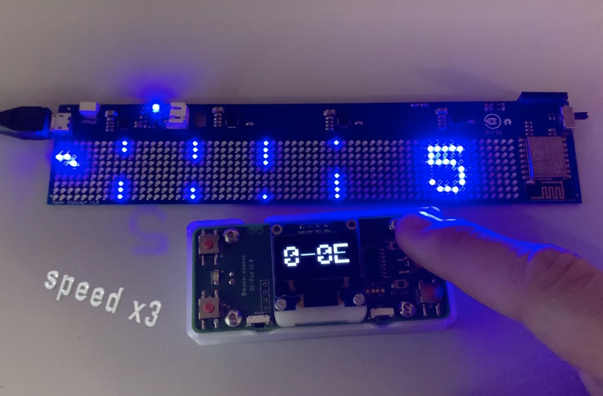

# FlappyBird Replica

(Click on the image for a small video.)

Just a 5 minute project for the Flappy Bird fans.

To play this game with the same setup shown in the video, you will need two things only:
- [MakerDisplay from e-radionica](https://www.crowdsupply.com/e-radionica/maker-led-display)
- [QiPad](https://github.com/makermoekoe/Qi-pad)

Of course this game could be shifted to any other hardware you want. it is even possible to play this game in the SerialMonitor inside the Arduino IDE.

I have added both the Arduino codes for the MakerDisplay as well as for the QiPad. The interesting part or lets say the physics of Flappy can be found in the MakerDisplay part.

Have fun. :)
